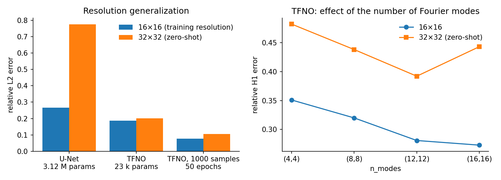

# Fourier Neural Operator on Darcy flow

Operator learning lab: learning the map from a permeability field $a(x,y)$ to the pressure field $u(x,y)$ solving the Darcy equation $-\nabla \cdot (a \nabla u) = f$, and comparing a (Tensorized) Fourier Neural Operator with a U-Net baseline, including on grids finer than the training grid. Based on the *Training on Darcy Flow* notebook of the [NeuralOperator](https://github.com/neuraloperator/neuraloperator) bootcamp.



## Highlights

- **TFNO vs U-Net**: at the training resolution (16×16), the TFNO lowers the relative L2 error by 30% (0.19 vs 0.27) with **135 times fewer parameters** (23 k vs 3.12 M).
- **Zero-shot super-resolution**: evaluated on 32×32 without retraining, the TFNO barely degrades (0.20) while the U-Net error triples (0.78), a global amplitude bias confirmed by the error spectrum.
- **Controlled ablations** over 2 seeds, one parameter at a time: training loss (H1 improves gradients and the physical flux), number of Fourier modes (too many modes hurt resolution generalization), width, depth, TFNO vs full FNO, and data budget.
- **Physical check on the flux** $\mathbf{v} = -a\nabla u$, and a **Navier-Stokes bonus**: a one-step FNO rolled out autoregressively over 20 time steps, with the error drift analyzed.

## Results

| Model | Parameters | Test 16×16, L2 | Test 32×32 (zero-shot), L2 |
|---|---:|---:|---:|
| U-Net | 3.12 M | 0.266 | 0.776 |
| TFNO | 23 k | 0.187 | 0.201 |
| TFNO, 1000 samples, 50 epochs | 23 k | 0.077 | 0.106 |

Mean over 2 seeds; the full table and its interpretation are in the notebook.

## Repository layout

```text
.
├── fno_darcy_flow.ipynb   # the lab, executed
├── docs/                  # Figures used in this README
└── requirements.txt
```

## Run it

```bash
pip install -r requirements.txt
jupyter notebook fno_darcy_flow.ipynb
```

The Darcy dataset is downloaded automatically by `neuraloperator`. The notebook runs on CPU; on a GPU, simply increase `n_train` and `n_epochs`. The 64×64 test set could not be downloaded in the environment used for the saved run, so the notebook fell back to the 16×16 and 32×32 test sets; on Colab, all three load normally.

## Context

Lab of the deep learning course at Centrale Lille. The lab statement and starter code were provided by the teaching staff; the implementation choices, experiments and analysis are my own. More on my [portfolio](https://ugo-roccamatisi.github.io).
